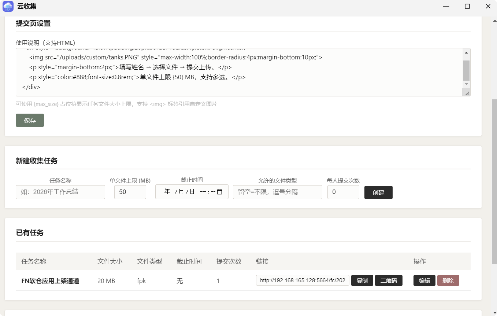
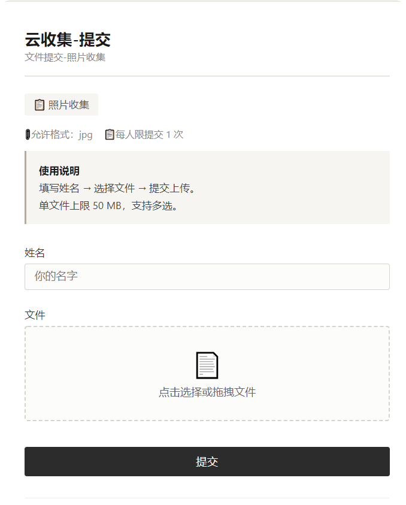

### 云收集


云收集(原名:文件收集助手)是一款为FNOS开发的轻量级文件收集工具，支持创建收集任务、多文件上传、二维码分享，适合团队文件收集、学生作业提交等场景。


#### 核心功能

##### 提交者（前台）
- 填写姓名/代号后提交文件
- 支持多文件同时上传
- 支持拖拽上传
- 实时显示上传进度
- 单文件大小限制（由管理员设定）

##### 管理员（后台）
- 创建收集任务（名称、文件大小上限、截止时间）
- 每个任务自动生成独立的提交链接
- 一键复制链接
- 生成任务二维码（扫码即可提交）
- 可自定义公网地址（适配域名或穿透地址）
- 删除任务（同时删除所有已上传文件）
- 修改管理员密码
- **提交页自定义**：管理员可自定义提交页使用说明，支持 HTML 格式（可插入图片、调整样式），支持 `{max_size}` 占位符自动显示当前任务的文件大小上限

##### 存储
- 按任务目录(以任务时间为名的文件夹)存储
- 任务目录下按提交者名称分目录存储
- 文件重名自动添加数字后缀
- 文件保存在飞牛「应用文件」中，可通过文件管理器直接访问


#### 安装

##### 通过应用中心安装
1. 下载 `cloud-collection.fpk`
2. 打开飞牛OS应用中心 → 手动安装
3. 上传 FPK 文件并安装
4. 安装过程中设置管理员账号和存储位置(如自定义存储位置，需在[应用设置]-[访问权限]-[允许访问的文件夹]里授权)

##### 安装向导
| 步骤 | 内容 |
|------|------|
| 第一步 | 设置管理员用户名和密码 |
| 第二步 | 选择存储位置（默认应用共享文件夹，可自定义路径） |

#### 预览图  
| 后台管理页 | 文件提交页 |
|:-----------:|:------------|
|||

#### 使用流程

##### 1. 登录后台
- 访问：`http://设备IP:5664/admin/login`
- 默认账号：`admin` / `admin123`

##### 2. 创建收集任务
进入管理后台 → 填写任务信息 → 点击「创建」
温馨提示：  
-如在局域网登录云收集并发起收集任务，可能需在后台公网收集地址里填写公网地址便于生成外网收集任务专属链接。  
-如需在自定义提交页中插入图片，请把图片放入存储目录下custom文件夹里。
-插入图片示例:
```

```


##### 3. 分享链接
复制生成的链接或二维码，发送给文件提交者

##### 4. 提交文件
提交者打开链接 → 填写姓名 → 选择文件 → 点击上传

##### 5. 查看文件
文件自动保存在飞牛「应用文件 / cloud-collection」目录中

#### 更新记录  
| 版本号 |   1.0.2  |
|--------|--------|
| 更新时间 | 2026-07-23|
|  更新项目 | 具体说明 |
| 后台管理 | 新增文件类型白名单设置功能 |
| 后台管理 | 新增每人提交文件次数设置功能|

| 版本号 |   1.1.0  |
|--------|--------|
| 更新时间 | 2026-07-31|
|  更新项目 | 具体说明 |
| 后台管理-任务列表 | 新增任务规则显示(文件名称/大小上限/类型/截止时间/提交次数/链接/操作等)功能 |
| 后台管理-任务列表 | 新增模态窗口，支持既有任务的规则编辑修改功能 |
| 前端页面 | 新增提交成功页面，文件提交后跳转独立成功页 |

| 版本号 |   1.2.0  |
|--------|--------|
| 更新时间 | 2026-08-12|
|  更新项目 | 具体说明 |
| 后台管理 | 新增提交页自定义功能，支持 HTML 格式自定义使用说明，可插入图片和样式 |
| 后台管理 | 提交页自定义内容支持 `{max_size}` 占位符，自动显示当前任务文件上限 |

